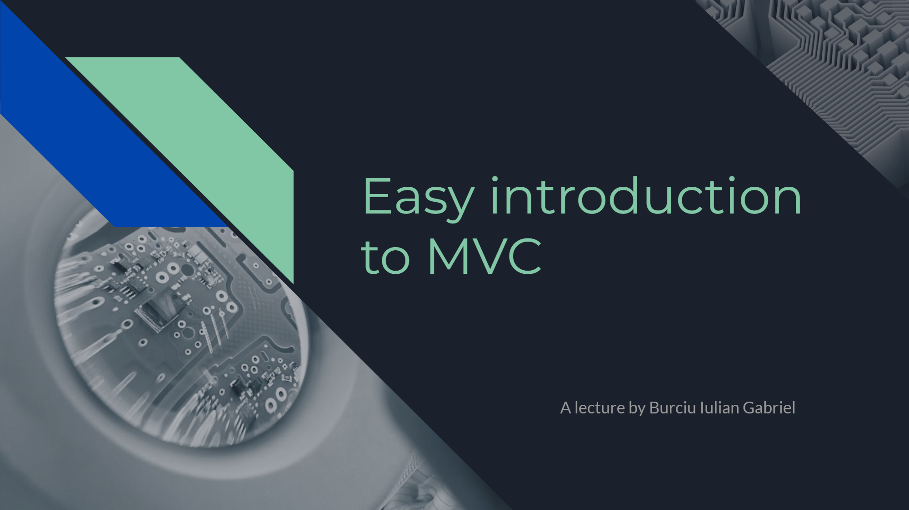

# MVC Lecture

This repository contains materials for a lecture on Model-View-Controller (MVC) architecture.

<p align="center">
  
</p>

## Lecture Content

The lecture covers the following topics:

- Introduction to MVC architecture
- Explanation of Model, View, and Controller components
- Practical example of MVC usage
- Reasons to use MVC in your projects


- ## Presentation Slides

The presentation slides are available in the [PDF](MVC-Lecture.pdf) format.

## Getting Started

To access the lecture materials:

1. Clone the repository:

   ```bash
   git clone https://github.com/IulianGabriel/MVC-Lecture.git
